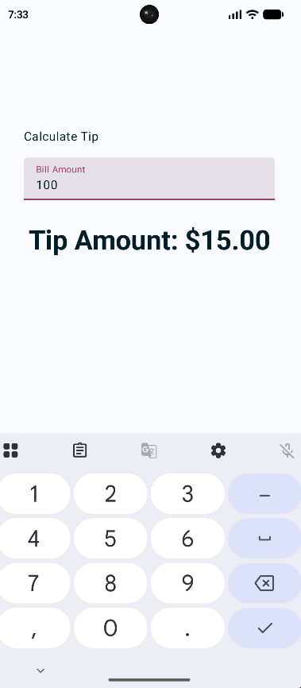

# Tip Time Calculator

[Читать на английском](README.md) | Русский

Android-приложение для расчёта чаевых на Jetpack Compose. Учебное задание по курсу **Мобильная разработка** в колледже.

<p align="center">
  
</p>

Приложение позволяет ввести сумму счёта и автоматически рассчитывает чаевые (15%), отображая результат в формате валюты. Сделано в рамках лабораторной работы по управлению состоянием в Jetpack Compose.

## Стек

- Kotlin
- Jetpack Compose
- Material 3
- Gradle (Kotlin DSL)

## Возможности

- Ввод суммы счёта через текстовое поле
- Автоматический расчёт чаевых (15%)
- Форматирование вывода в виде валюты
- Цифровая клавиатура для ввода

## Чему я научился

- **State и MutableState** — наблюдаемое состояние в Compose
- **`remember`** — сохранение состояния между рекомпозициями
- **Делегирование свойств (`by`)** — более чистый доступ к `MutableState`
- **State Hoisting** — вынос состояния в родительский composable
- **Позиционное форматирование** — `%s` в `strings.xml`
- **Stateless composables** — переиспользуемые, тестируемые компоненты

## Как запустить

1. Клонировать репозиторий:

```bash
git clone https://github.com/quarnel-dev/tip-time-calculator.git
```

2. Открыть проект в Android Studio
3. Дождаться синхронизации Gradle
4. Запустить на эмуляторе или физическом устройстве (Android 7.0+)

*Сделано с ❤️ от Quarnel*
